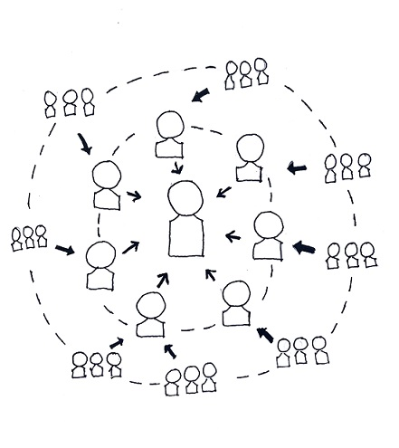
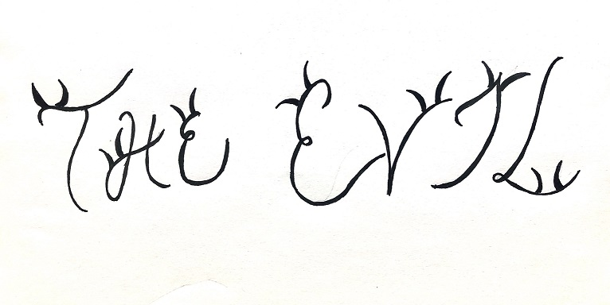
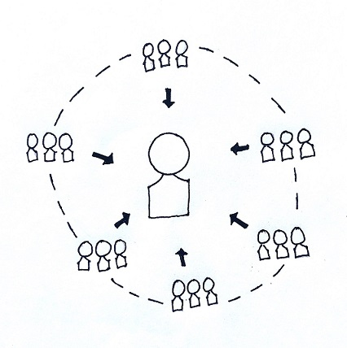

# Hierarchy
## The Good, The Bad and
## The Evil
Paromita Chakraborty and Wassim Kraouch

22.10.2020

Professor: Dr. Ulrich Anders

---

# Hierarchy

A system in which people or things are arranged according to their importance.

(Cambridge dictionary)

---

There are two types of organizational structure:
1. Hierarchical organizational structure
1. Flat organizational structure 

---

## 1. Hierarchical organizational structure

Meaning: 

---

Example: Amazon

---

---

## Hierarchical organizational structure

* Defined level of leadership 
* Clear career path and promotion
* Promotes specialization
* Creates loyalty in departments

---

---

## Hierarchical organizational structure

* Centralized power structure
* Communication barrier
* Increased organization’s cost
* Decision making relatively slow

---

---

## Hierarchical organizational structure

* Corruption, exploitation, and organizational crime
* Abuse of power and intimidation
* Harassment and discrimination  
* Violence, suicide, and murder 

---

## 2. Flat organizational structure (Wassim)

Meaning:

---

Example:

---

---

## Flat organizational structure (Wassim)

* It elevates the employees' level of responsibility in the organization
* It Allows Clear Communication
* Faster Decision Making
* It Is Cost Efficient

---

---

## Flat organizational structure (Wassim)

* lack a specific boss to report to
* Flat organizations tend to produce a lot of generalists but no specialists
* Flat structure may limit long-term growth of an organization

---

---

## Flat organizational structure (Wassim)

---

## Question

---
# References

Leavitt, H. (2003). Why hierarchies thrive.

[https://hbr.org/2003/03/why-hierarchies-thrive](https://hbr.org/2003/03/why-hierarchies-thrive)

Sutton, B. (2016). Hierarchy is good. hierarchy is essential. And less isn’t always better. 

[https://ecorner.stanford.edu/articles/hierarchy-is-good-hierarchy-is-essential-and-less-isnt-always-better/](https://ecorner.stanfohierarchy-is-good-hierarchy-is-essential-and-less-isnt-always-better/)

---

Bailey, S. (2014). Is hierarchy helping or harming your organization?

[https://www.forbes.com/sites/sebastianbailey/2014/03/19/is-hierarchy-helping-or-harming-your-organization-2/#6232a7e56e40](https://www.forbes.com/sites/sebastianbailey/2014/03/19/is-hierarchy-helping-or-harming-your-organization-2/#6232a7e56e40)

Linstead et al. (2010). The Dark Side of Organization. 

[https://www.researchgate.net/publication/295368506_The_Dark_Side_of_Organization](https://www.researchgate.net/publication/295368506_The_Dark_Side_of_Organization)
